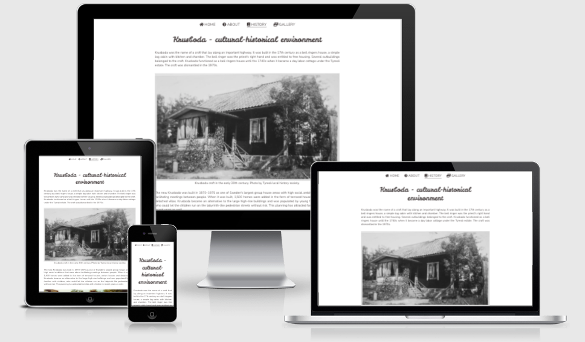

# Welcome to Krusboda

The welcome to Krusboda website is an informative site providing useful information about the residential area of Krusboda in Stockholm, Sweden. Users could for example be residents, visitors or potential home buyers in the area.

Users of this website will be able to find useful information about the area, as well as imagery to help them get an insight of what it’s like there.

## Features

### Navigation
Featured at the top centre of the page, the navigations shows four options: Home (takes user back to the home page), About, History and 
Gallery. Each option is illustrated by a font awesome-icon to make them easier to distinguish. 

The navigation menu is in a font that matches the rest of the page’s body text and in the same dark grey color. 

The section that the user is currently visiting is underlined for easy overview.

When hovered, the links to the other pages are underlined so that the user knows they are clickable links.  

### Header
The header shows the words ”Welcome to Krusboda” in a dark grey color on a background image of a view overlooking some houses and forest and a cat in the foreground.

### Home page
The homepage consists of the main header that is in the same color but a contrasting font than the body text to make it stand out. 

Under the main header and image there are three smaller headers that read: ”Built in 1970-75”, ”Surrounded by nature” and ”A great community”, in the same font and color but smaller.

Under each header there is an image to illustrate and create context. Under each image is a short piece of text that explains something about the area relating to the image. 

The purpose of this section is to give the users an idea of what the area is like and to make them curios about finding out more.  

The home page also shows a footer that ontains an embedded google map that shows the location of the area. 

The footer also contains copyright info and a hyperlink that allow users to send an email to the site owner.

### About page
Takes the user to an article which describes the area and general facts about it, with illustrating images. 

The purpose of this section is to provide information to those interested and give a more extensive picture of the area than is suitable on the home page.

### History page 
Takes the user to an article which describes the historical facts surrounding the area, also with illustrating images like in the ”About”-page.

The purpose of this section is to provide information to those interested in finding out more and learn about the history of the area.

### Gallery page
Takes user to a gallery with images and videos portraying the area. 

When hovered the images scale up to 1.5 size and also show a descriptive text inside the image.

The purpose of this is to showcase the area and it’s pleasant surroundings.

## Testing

The website works in the following browsers:
Chrome, Firefox, Safari.
The project is responsive, functional and looks good in all of the standard screen sizes available in devtools.

I have confirmed that the mailto-link works, as well as the video control actions.

## Bugs

When deployed to GitHub Pages I discovered that one of the images in the gallery did not load properly. This was because the image file was very large. I therefore decided to convert all of my images from .jpeg to .webp to make them smaller and to make the website load faster.

## Validator testing
No errors were returned when passing through the official W3C validator. 

No errors were returned when passing through the official (Jigsaw) validator. 

## Accessibility
I confirmed that the colors and fonts chosen are easy to read and accessible by running it through lighthouse in devtools.

## Deployment
The site was deployed to GitHub Pages (GitHub repository > settings, select branch main and click save). 

The live link can be found [here](https://jossansik.github.io/Portfolio-project1/)

## Credits

I have based the scaling hover effect on the gallery images on the following [code](https://codepen.io/ran0904/pen/bNpLvX)